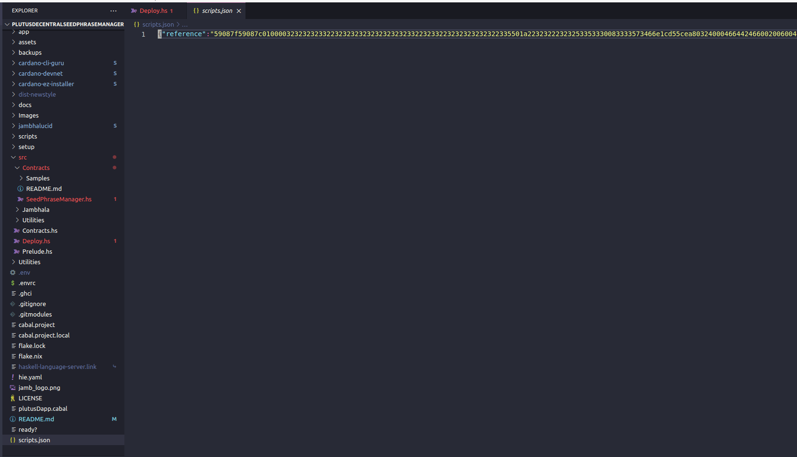

# Decentralized Seed Phrase Manager


This Repo has the code for developing the Cardano Plutus OnChain part for the Decentralized seed phrase manager project. For details refer to the below repo:

https://github.com/rchak007/decentralSeedRecover


Jambhala framework was used to develop the plutus code.

https://github.com/iburzynski/jambhala was used as template to start.


## OnChain Code

https://github.com/rchak007/plutusAppsJambhala/blob/main/src/Contracts/SeedPhraseManager.hs


## Datum

```haskell
data SeedPhraseDatum = SeedPhraseDatum
  { encryptedWordsWithIndex :: BuiltinByteString,
    ownerPKH :: PubKeyHash
  }

unstableMakeIsData ''SeedPhraseDatum

```

## Parameterized 

```haskell
data SeedPhraseParam = SeedPhraseParam
  { pInfoHash :: BuiltinByteString
  }
  deriving (Haskell.Show)
```


## Redeemer

```haskell
data SeedPhraseRedeem = Unit ()
```


## Validator

```haskell

mkRequestValidator :: SeedPhraseParam -> SeedPhraseDatum -> () -> ScriptContext -> Bool
mkRequestValidator sParam dat _ ctx =
  traceIfFalse "signedByOwner: Not signed by ownerPKH" signedByOwner
  where
    txinfo :: TxInfo
    txinfo = scriptContextTxInfo ctx

    signedByOwner :: Bool
    signedByOwner = txSignedBy txinfo $ ownerPKH dat
{-# INLINEABLE mkRequestValidator #-}


```


```haskell
-- referenceInstance :: Scripts.Validator
referenceInstance :: Validator
-- referenceInstance = Api.Validator $ Api.fromCompiledCode $$(PlutusTx.compile [||wrap||])
referenceInstance = Validator $ fromCompiledCode $$(PlutusTx.compile [||wrap||])
  where
    -- wrap l1 = Scripts.mkUntypedValidator $ mkRequestValidator (PlutusTx.unsafeFromBuiltinData l1)
    wrap l1 = mkUntypedValidator $ mkRequestValidator (PlutusTx.unsafeFromBuiltinData l1)
    
    
    

referenceSerialized :: Haskell.String
referenceSerialized =
  C.unpack $
    B16.encode $
      serialiseToCBOR
        -- ((PlutusScriptSerialised $ SBS.toShort . LBS.toStrict $ serialise $ Api.unValidatorScript referenceInstance) :: PlutusScript PlutusScriptV2)
        ((PlutusScriptSerialised $ SBS.toShort . LBS.toStrict $ serialise $ unValidatorScript referenceInstance) :: PlutusScript PlutusScriptV2)
```


## Deploy


https://github.com/rchak007/plutusAppsJambhala/blob/main/src/Deploy.hs


```haskell
scripts :: Scripts
scripts = Scripts {reference = Contracts.SeedPhraseManager.referenceSerialized}

main :: IO ()
main = do
  -- writeInitDatum
  -- writeContractDatum

  -- _ <- writeValidatorScript
  -- _ <- writeLucidValidatorScript
  I.writeFile "scripts.json" (encodeToLazyText scripts)
  putStrLn "Scripts compiled"

  return ()


```


### .plutus

this would create .plutus file that can be used in Lucid by also applying parameter



